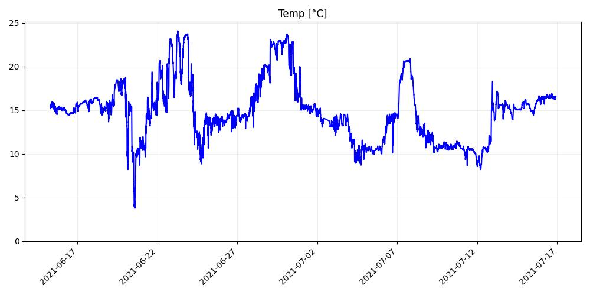
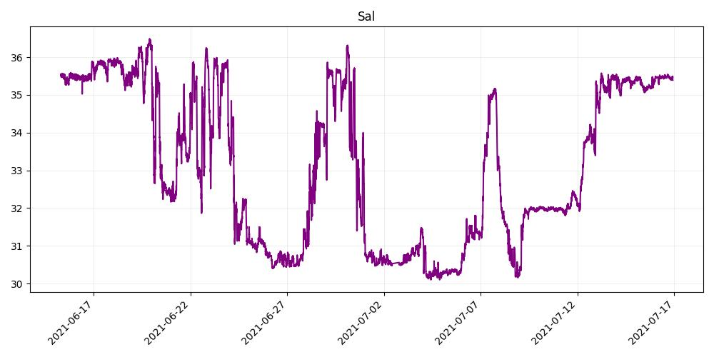

# ML4ShipTelemetry

## Framework
This is a collaboration between the Department of Data Science ([MF-DAS](https://www.dlr.de/de/eoc/ueber-uns/institut-fuer-methodik-der-fernerkundung/eo-data-science)) at the Earth Observation Center (EOC) of German Aerospace Center (DLR) and [Geomar](https://www.geomar.de/), within the [Helmholtz AI consulting framework](https://www.helmholtz.ai/you-helmholtz-ai/ai-consulting/).

## Goal
The goal of this project is to build a Machine Learning (ML) model capable of inferring data typically calculated through mathematical methods from thermosalinograph data collected during ship expeditions. Specifically, we aim to determine whether an ML model can accurately reconstruct temperature and salinity trends using multivariate time series data from ship sensors.

## Methodology

We approached this task as a supervised learning problem, with thermosalinograph measurements as input data and temperature and salinity as output targets. Using temperature and salinity ground truth data provided by GEOMAR, we trained a Random Forest (RF) regressor. We performed 5-fold cross-validation to evaluate the model, measuring its accuracy with the R² score, which indicates the percentage of variance in the dependent variable explained by the model. Our RF regressor achieved an R² score of 0.99, and visual analysis of the predictions confirms that the model's output closely aligns with the reference data.

| Temp Reference         | Temp Prediction         | Sal Reference         | Sal Prediction         |
|------------------------|-------------------------|-----------------------|------------------------|
|  |  |  |  |

## Run Our Work

Our project is packaged as a Python module, which can be easily installed with:

```bash
pip install ml4shiptelemetry
```

Once installed, you can begin cross-validating the RF regressor with:

```bash
python -m ml4shiptelemetry --data-dir your/path/to/data --cv
```

Replace `your/path/to/data` with the directory containing your thermosalinograph and ground truth data.

For datasets with time series nature, i.e. the samples are ordered and subsequent samples are correlated, a time series cross validation can be used instead. Activate the time series cross validation by using the `--ts_cv` flag:

```bash
python -m ml4shiptelemetry --data-dir your/path/to/data --cv --ts_cv
```

The following flags can be used in the command line call:

```bash
--data-dir [string]             Path to raw data. Required.
--cv                            Crossvalidate model performance on training data. Leave out to not crossvalidate. Applies K-fold without shuffling (unless overridden by ts-cv).
--ts-cv                         Use time series cross validation instead of regular cross validation.
--cv-params [string]            Path to json file containing cross-validation hyperparameters to exhaustively evaluate.
--n-test-files [integer]        Number of data files to use as test set. Test files are picked from the back of the list of files.
--n-neighbours [integer]        Number of neighbouring rows to add to each row in the training set. For example, a value 1 means adding the row before and after.
--preprocessed-dir [string]     Directory to store processed data for faster reprocessing next time.
--model-output-dir [string]     Directory to store models as pickle files.
--log-dir [string]              Directory to save log file.
--verbose [integer]             Verbosity of scikit-learn GridSearchCV.
```

## Future work

We want to extend what we did until now by:
- Using statistical procedures to add confidence intervals to the prediction
- Exploring the use of deep learning methods